# SIFT on CPU&GPU and its optimization

## 目录

[TOC]


## 一、SIFT算法及其并行化意义

### 1. 算法目的

SIFT（Scale Invariant Feature Transform）是计算机视觉中一种经典的特征提取方法，它主要被提出来实现具有尺度不变性的特征提取，即无论物体在图像中处于何种尺度，SIFT都可以找到对应的特征点和相似的特征描述。此外，SIFT还具有旋转不变性，对光照变化、视角变化、遮挡等影响具有较强的鲁棒性，从一张图片中可以产生大量的具有区分度的SIFT特征，对下游的物体识别、图像拼接等任务非常适用。

### 2. 算法实现原理

SIFT特征提取主要分为以下阶段：

- 检测图像尺度空间上的极值点

    构建高斯金字塔，在高斯差分空间上检测极值点。

    这一步需要构建高斯金字塔，作为图像的尺度空间表示。高斯金字塔由多个octave组成，每个octave包含S+3层图像，第一个octave的第一层图像由原图2倍上采样得到，此后每个octave的第一层图像由上一个octave的第S层1/2倍下采样得到，每个octave中，下一层由上一层进行高斯模糊得到，它们相对于原图的高斯模糊参数是以$2^{1/S}$为间隔连续的。高斯差分金字塔的每个octave由高斯金字塔的每个octave的每相邻两层的后一层减去前一层得到。

    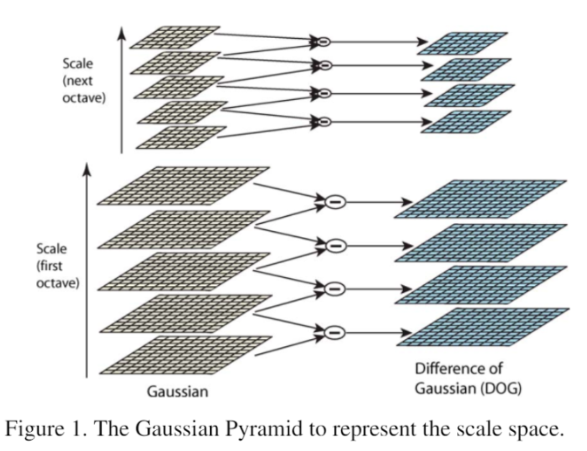

- 极值点定位

    实用3维二次型函数拟合高斯差分空间，从而精确定位极值点，同时过滤掉低对比度的点和边缘上的点，减少样本点的不稳定性，提高其区分性。

- 方向赋值

    为每个极值点统计其邻域上的梯度方向分布，将最大的梯度方向作为极值点的主方向。

- 特征描述

    对每个极值点，将其邻域分成若干个子区域，用直方图统计每个子区域相对于主方向的梯度方向的分布，将所有分布信息作为该极值点的特征描述。

### 3. 并行化意义

SIFT具有很强的鲁棒性，在很多计算机视觉任务中都可以提供具有区分度的特征。但原始SIFT算法的一个缺点是它计算量较大，运行速度还无法满足实时性要求，因此只能应用在一些对实时性要求不高的任务中。如果能够并行化SIFT，实现SIFT的加速，那么将大大扩展SIFT的实用场景。

SURF是一种近似SIFT的速度更快的特征提取算法，它使用简单的盒式滤波器近似高斯滤波，并舍弃了下采样操作，使得金字塔中每一层都可以独立地从输入层生成，其实更适于并行化。之所以选择并行化SIFT，是因为：

- SIFT效果更好
- SURF的计算速度已经优化的比较快，而SIFT的计算速度还有很大优化空间
- SIFT的优化更有难度

## 二、 预期目标与实际完成内容

### 1. 预期目标

- 实现SIFT的基本算法
- 实现SIFT主要环节的并行化
- 针对SIFT的计算瓶颈进行优化
- 比较并行化版本与基本算法、opencv版本、参考论文的结果
- 如果实验结果不理想，可以参考论文进行改进

### 2. 实际完成内容

- 使用C++实现了SIFT的CPU算法
    - 使用Python对CPU算法的主要环节做单元测试
    - 采取较高效的CPU算法，如将二维卷积用两次一维卷积代替
- 通过实验发现SIFT的计算瓶颈：高斯金字塔构建阶段
- 针对高斯金字塔构建阶段进行优化
    - 使用CUDA实现卷积
    - 使用OpenMP并行化单个octave
    - 减少了显存拷贝次数
    - 加速比最高达16左右

## 三、 CPU实现及代码架构描述

> 这里只叙述代码的组织架构与每个功能函数的意义，每个函数具体的实现细节及解释详见附录一

### 1. 主函数

主函数的作用就是提取图像的sift特征并将其绘制在res_img上，就是调用各个阶段的不同函数并根据不同阶段计时，并打印各阶段时间，至于为什么写成了`extern "c"`而不是`main`在后面会有解释；主函数也体现了代码的框架与函数组织。

```c
/******************************************************************
/*	函数: sift
/*	函数描述：提取图像的sift特征 将其绘制在res_img上
/*	参数描述：
/*		gray_img：原图像地址，图像为二维数组，每个元素为灰度整数值
/*  	n、m：图像高、宽
/*  	kr：特征描述：样本点所在region的大小为kr x kr
/*  	ks: 特征描述：region划分为ks x ks个subregion
/*  	ko：特征描述：描述每个subregion的方向直方图的bins个数（均匀划分360度）
/*  	S：金字塔：中间层数（每个octave是S+3层）
/*  	sigma_init：金字塔：第一层使用的高斯模糊参数
/*  	contrast_threshold：样本点检测：用于低对比度样本点过滤的阈值大小 如0.03
/*  	edge_response_threshold：样本点检测：用于边缘响应样本点过滤的阈值大小 如10
/*  	max_iterpolation：样本点检测：最大变换插值次数
/*  	time_arr4：记录每个阶段（金字塔构建、样本点检测、主方向赋值、特征生成）的用时，单位为秒
/********************************************************************/
extern "C" void sift(gray_t* gray_img, gray_t* res_img, int n, int m, int kr, int ks, int ko, int S, double sigma_init, double contrast_threshold, double edge_response_threshold, int max_iterpolation, double* time_arr4) {
	// 高斯金字塔
    time_arr4[0] = - get_time();
	// 1. 高斯层
	std::vector<Layer> Gauss_pyramid;
	build_Gauss_pyramid(gray_img, n, m, Gauss_pyramid, S, sigma_init);
    time_arr4[0] += get_time(); 
    printf("Build Pyramid: %.3lf s\n", time_arr4[0]);
	// 极值点检测
    // 2. 高斯差分层
    time_arr4[1] = - get_time();
	std::vector<Layer> DoG_pyramid;
	build_DoG_pyramid(Gauss_pyramid, DoG_pyramid, S);
	std::vector<KeyPoint> keypoints;
	detect_keypoints(DoG_pyramid, keypoints, S, contrast_threshold, edge_response_threshold, max_iterpolation);
    time_arr4[1] += get_time();
    printf("Number of points: %lu \nKeypoints Detect: %.3lf s\n", keypoints.size(), time_arr4[1]);
	// 主方向提取
    time_arr4[2] = - get_time();
	assign_orient(Gauss_pyramid, keypoints, S);
    time_arr4[2] += get_time(); 
    printf("Orientation Assignment: %.3lf s\n", time_arr4[2]);
	// 描述生成
    time_arr4[3] = - get_time();
	generate_features(keypoints, Gauss_pyramid, kr, ks, ko, S);
    time_arr4[3] += get_time();
    printf("Descriptor Generation: %.3lf s\n", time_arr4[3]);
    // 绘制结果
    draw_keypoints(gray_img, res_img, n, m, keypoints);
    // 释放空间
    free_space(Gauss_pyramid);
    free_space(DoG_pyramid);
    //free_space_feat(keypoints);
}
```

### 2. 功能函数

- `guassian_smooth`：对图像进行高斯模糊，平滑参数为sigma，结果保存到img_dst

    ```c
    void guassian_smooth(const gray_t* img_src, gray_t** img_dst_ptr, int n, int m, double sigma);
    ```

- `double_sample`：对图像进行2倍上采样（图像的双线性插值）

    ```c
    void double_sample(const gray_t* img_src, gray_t** img_dst_ptr, int* n, int* m) ;
    ```

- `half_sample`：对图像进行1/2下采样

    ```c
    void half_sample(const gray_t* img_src, gray_t** img_dst_ptr, int* n, int* m);
    ```

- 构建图像的高斯金字塔层与高斯差分金字塔层

    ```c
    void build_Gauss_pyramid(gray_t* gray_img, int n, int m, std::vector<Layer>& Gauss_pyramid, int S, double sigma_init);
    void build_DoG_pyramid(std::vector<Layer>& Gauss_pyramid, std::vector<Layer>& DoG_pyramid, int S);
    ```

- `detect_keypoints`:从高斯差分金字塔中检测极值点

    ```c
    void detect_keypoints(std::vector<Layer>& DoG_pyramid, std::vector<KeyPoint>& keypoints, int S, double contrast_threshold, double edge_response_threshold, int max_iterpolation);
    ```

- `interpolate_keypoints`:极值点筛选，对检测到的极值点进行插值更新、过滤

    ```c
    void interpolate_keypoints(std::vector<Layer>& DoG_pyramid, int S, int& x, int& y, int& layeri, int layer, double contrast_threshold, double edge_response_threshold, int max_iterpolation);
    ```

- `assign_orient`:为样本点赋值主方向

    ```c
    void assign_orient(std::vector<Layer>& Gauss_pyramid, std::vector<KeyPoint>& keypoints, int S);
    ```

- `generate_features`:生成样本点的特征描述

    ```c
    void generate_features(std::vector<KeyPoint>& keypoints, std::vector<Layer>& Gauss_pyramid, int kr, int ks, int ko, int S);
    ```

- `draw_keypoints`:将样本点绘制在图片上

    ```c
    void draw_keypoints(gray_t* src_img, gray_t* res_img, int n, int m, std::vector<KeyPoint>& keypoints);
    ```

## 四、 GPU实现及其优化

> 这里只叙述优化的思路与大致过程，具体的优化实现详见附录

首先，上面的CPU版本在运行时根据不同阶段分别计了时，运行之后会发现第一阶段构建金字塔消耗的时间远远大于其它阶段，所以我们将着重优化这一部分。

### 1. OpenMP优化

在上述实现的高斯金字塔构建算法中，每一个octave的第一层由上一个octave的第S层下采样得到，因此下一个octave的构建依赖于前一个octave的构建。由于上一个octave的第S层是由上一个octave的第1层不断高斯模糊得到的，所以不能在构建完上一个octave的第S层之前开始构建下一个octave，因此无法并行开始每个octave的构建。

在每个octave内部，第$i$层由第$i-1$层进行高斯模糊得到（参数为$\sigma_{oi} = \sqrt{(2^{i/S}\sigma_o)^2 - (2^{(i-1)/S}\sigma_o)^2} = 2^{(i-1)/S}\sigma_o\sqrt{2^{2/S}-1}$），使得其相对于原始上采样图片的模糊参数分别为：
$$
\sigma_o,2^{1/S}\sigma_o,2^{2/S}\sigma_o,2^{3/S}\sigma_o,2^{4/S}\sigma_o,...
$$
这样每一层的生成都对前一层的生成有依赖，无法并行。

为此，我们可以让octave内部，第$i$层由第$1$层直接进行高斯模糊得到（参数为$\sigma_{oi} = \sqrt{(2^{i/S}\sigma_o)^2 - \sigma_o^2} = \sigma_o\sqrt{2^{2i/S}-1}$），这样虽然使得每个$\sigma_{oi}$增大了（比例为$\frac{\sqrt{2^{2i/S}-1}}{\sqrt{2^{2i/S}-2^{2(i-1)/S}}}=\sqrt{\frac{2^{2/S}-2^{-2(i-1)/S}}{2^{2/S}-1}}$），使得每次卷积的复杂度增加，但是好处是每一层可以独立生成，由于生成的计算比较复杂，所以可以考虑用OpenMP进行并行，带来几倍加速。我们期待octave内部层数$S$较大时，该并行方法可以实现加速。

### 2. 卷积的CUDA实现

在卷积的实现过程中，我们可以使用**两次一维卷积代替二维卷积**，并且在每次一维卷积中，当卷积范围在图片中越界时，越界部分都采用边界值$b$填充。此外，由于高斯卷积核的对称性，卷积核只需原始的一半空间。在卷积CPU优化之后，显著降低了内层循环次数，也为CUDA优化提供了便利，于是便可以将这两次卷积放在GPU上计算。

### 3. 共享内存优化

在卷积中有一个for循环需要对卷积核反复读写，即需要反复读写全局内存，延迟较大，故我将卷积核放入共享内存存储，由于卷积核的大小在编译时未知，故需要在调用核函数时使用第三个参数给出大小。此外由于动态共享内存只支持线程块一维组织，所以还需要改为一维线程实现。

### 4. 显存拷贝优化

当我们把卷积计算放到CUDA上时，需要将被卷积的图片拷贝到设备上，将卷积结果拷贝回主机，这样虽然卷积计算的时间减少了，但是额外增加了内存拷贝的时间。仔细分析高斯金字塔构建的过程，可以发现，如果一开始就把图层放到显存上（每个layer记录一个img指针指向显存），那么每次卷积都不需要内存拷贝。这还带来一个好处是其他操作也可以在GPU上加速（而免受内存拷贝带来的负优化），比如我们也将下采样操作在GPU上实现。

不过由于我们只对高斯金字塔的构建进行加速，后续的操作都需要在CPU上进行，所以在高斯金字塔构建完成之后，还需要将所有图层从显存拷贝回来。即使这样，拷贝次数也缩减为原来的一半。如果有机会将后续操作都放在GPU上实现，那么就不用拷贝回来（我们只需要最后的样本点及其特征描述）。

### 5. 卷积核计算的规约与扫描优化

前面提到，在后面的octave中，卷积核大小会比较大，此时可以将卷积核参数的计算也用CUDA加速，额外的好处是卷积核可以直接在显存上申请，无需内存拷贝即可用于卷积。

在我们的卷积实现中，需要的卷积核参数及其计算过程、优化思路如下：

- filter：高斯卷积核的前$\lfloor k/2\rfloor + 1$个参数（后续参数与前一半对称）
  - 计算过程：计算每个位置高斯函数值，对所有高斯函数值求和（由于对称性，和为前$\lfloor k/2\rfloor$个值的和的两倍加上第$\lfloor k/2\rfloor + 1$个值），对已有值进行归一化
  - 优化思路：使用CUDA8.pdf的规约算法求和
- pre_filter：filter的前缀和
  - 优化思路：使用CUDA7.pdf的扫描算法求前缀和

## 五、文件说明及运行、测试说明

### 1. 测试方法说明

由于SIFT是对图像进行操作，我们考虑到了python对于图像处理的便携性以及OpenCV库的方便，于是我们决定将写好的c++及cuda文件编译为`.so`共享库，整个运行流程为先用python读取图片并转为np灰度数组（当sift算法精度为double时，其类型dtype应转换为float64），再使用ctypes进行数据转换，调用`.so`共享库运行SIFT，最后再由python保存并显示结果图片。

完整测试代码如下，测试不同的程序只需要更改第25行调用的共享库即可：

```python
import cv2
import ctypes
import numpy as np
from ctypes import cdll
import matplotlib.pyplot as plt

if __name__ == '__main__':
    mg_cv = cv2.imread("test.JPG")
    gray=cv2.cvtColor(mg_cv,cv2.COLOR_BGR2GRAY)
    n = gray.shape[0]
    m = gray.shape[1]
    res = np.empty((gray.shape[0], gray.shape[1]), dtype='float64')
    gray = gray.astype('float64') # double
    
    kr = 16
    ks = 4
    ko = 8
    S = 3
    sigma_init = 0.5
    contrast_threshold = 0.03
    edge_response_threshold = 10.0
    max_iterpolation = 10
    time_arr4 = np.empty(4, dtype='float64')
    
    test = cdll.LoadLibrary("./lib/siftcpu.so")
    
    #声明共享库函数的argtypes（对于numpy数组，使用np.ctypeslib.ndpointer）
    test.sift.argtypes = [np.ctypeslib.ndpointer(dtype=gray.dtype, ndim=2, shape=gray.shape, flags='C_CONTIGUOUS'), 
                              np.ctypeslib.ndpointer(dtype=res.dtype, ndim=2, shape=res.shape, flags='C_CONTIGUOUS'),
                              ctypes.c_int,  # n
                              ctypes.c_int,  # m
                              ctypes.c_int,  # kr
                              ctypes.c_int,  # ks
                              ctypes.c_int,  # ko
                              ctypes.c_int,  # S
                              ctypes.c_double,  # sigma_init
                              ctypes.c_double,  # contrast_threshold
                              ctypes.c_double,  # edge_response_threshold
                              ctypes.c_int,  # max_iterpolation
                              np.ctypeslib.ndpointer(dtype=time_arr4.dtype, ndim=1, shape=time_arr4.shape)
                             ]
    # 调用时直接传递Python变量（除了传指针：需要使用ctypes.POINTER声明argtypes，用ctypes.pointer传参）
    test.sift(gray, res, n, m, kr, ks, ko, S, 
              sigma_init, contrast_threshold, 
              edge_response_threshold, max_iterpolation, time_arr4)
    plt.imshow(res, cmap='gray')
    plt.savefig("res/cpu.png")
```

### 2. 文件说明

- `src`目录下为源代码文件（每个版本均在前一个版本的基础上完成）：
    - `sift.cpp`：原始CPU实现
    - `sift_omp.cpp`：使用OpenMP优化单个octave
    - `sift.cu`：使用GPU计算卷积
    - `sift_share.cu`：使用了共享内存
    - `sift_device.cu`：显存拷贝优化与下采样的cuda优化
    - `sift_final.cu`：卷积核计算的规约与扫描cuda优化
- `lib`目录下为编译出的`.so`库文件
- `test`目录下为对应名字cuda程序的的测试程序
- `res`目录下为运行之后输出的结果图片
- `run.sh`为编译运行所有程序的shell脚本
- `test.ipynb`文件包含了单元测试的例子（绘制高斯金字塔的前几层、绘制特征点）

### 3. 实验环境

- CPU: Intel(R) Xeon(R) Gold 6134 CPU @ 3.20GHz
- GPU: NVIDIA Tesla V100 32GB
- 系统： Ubuntu 18.04
- g++版本： 7.5.0 
- Cuda版本： 10.1
- python版本：3.8.3

### 4. 程序编译运行说明

- 对于c++文件，编译时需要添加`-fPIC -fopenmp -shared`
- 对于cuda文件，编译时需要添加`-Xcompiler -fopenmp -Xcompiler -fPIC -shared`
- 额外的，对于最后一个版本即`sift_final.cu`需要另外添加`-arch=sm_70`以使用`atomicAdd`函数
- 编译后直接运行python文件即可

使用的命令举例：

```sh
#若位于sift目录下
#编译
g++ ./src/sift_omp.cpp -fPIC -fopenmp -shared -o ./lib/siftomp.so 
nvcc ./src/sift_share.cu -Xcompiler -fopenmp -Xcompiler -fPIC -shared -o ./lib/siftshare.so
nvcc ./src/sift_final.cu -arch=sm_70 -Xcompiler -fopenmp -Xcompiler -fPIC -shared -o ./lib/siftfinal.so
#运行
python ./test/test_cpu.py 
```

此外，由于文件较多，我还写了一个bash脚本自动编译所有文件并运行所有版本，使用命令如下：

```bash
sh run.sh
```

## 六、代码正确性验证

验证SIFT的正确性只需要判断最后的结果图片是否一致即可，对于一张图片，原图、CPU版本的结果图、GPU最终版的结果图分别如下所示：

<table frame="void" border=0> 
    <tr>
        <td></td> 
    </tr>
    <tr>
        <td></td> 
    </tr>
    <tr>
        <td></td> 
    </tr>
</table>

可以看出CPU版本和GPU版本的结果图片一致，而且均显示出了特征点，故结果正确。

## 七、 实验结果与分析

我们将不同阶段的代码分别保存为不同的文件分别测试，并且分别测试了分辨率为4032 × 2262、2560 × 1440以及640 × 771的大中小三张图片，分别运行脚本程序截图如下：

<table frame="void" border=0> 
    <tr>
        <td></td> 
        <td></td> 
        <td></td> 
    </tr>
</table>
可以看到每个版本检测出来的特征点的个数都是一样的，这也从侧面反映了我们的结果是正确的。

将以上运行结果绘制成图表如下所示：

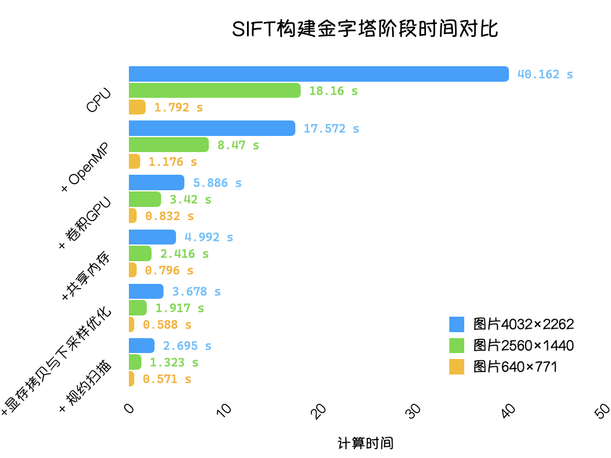

可以看到我们的每一步的确都是有优化效果的，对于一张大图片而言单纯将卷积放在GPU上计算就可以获得约6.8倍的加速比，再经过后面的优化加速比最高可以达到约14.9，而这个数字在中等规模的图片上就减小到了13.7，到了小图片上的加速比只有3.13。

这和我们前两次作业在一定范围内矩阵维数越大加速比越大的情况是一致的，只有当图片分辨率较大的时候有了更多的重复计算之后使用Cuda才可以获得更大的加速。

另外我们发现虽然CPU版本使用OpenMP可以获得加速，但是在GPU上却并不能加速，这是因为我们只用了一张显卡，所以并不能获得加速。

此外，从运行时间上来看， 在大图片上，起初构建金字塔部分约占总时间的64.5%，优化过后这一部分计算时间占比缩减到了6.89%，这也反映了我们做的优化是有意义的，的确达到了加速的效果。

最后，还有一个问题就是加速比只有15左右，并没有像前两次作业有着几百几千的加速，首先我觉得这是因为我们的这个问题并不像矩阵加法和熵的计算那样是“大规模的重复简单计算”，sift的每个线程有着更为复杂的任务，同时我们的CPU版本也是经过了多次优化的，并没有使用最暴力的版本进行对比，故我们的CUDA算得上“优中比优”；此外就是根据课上所讲的Amdahl’s Law，程序效率受限于其可并行的比例，$s=\frac{1}{1-p}$，他们之间的关系如下图所示（取自课件CUDA-1的第33页）：

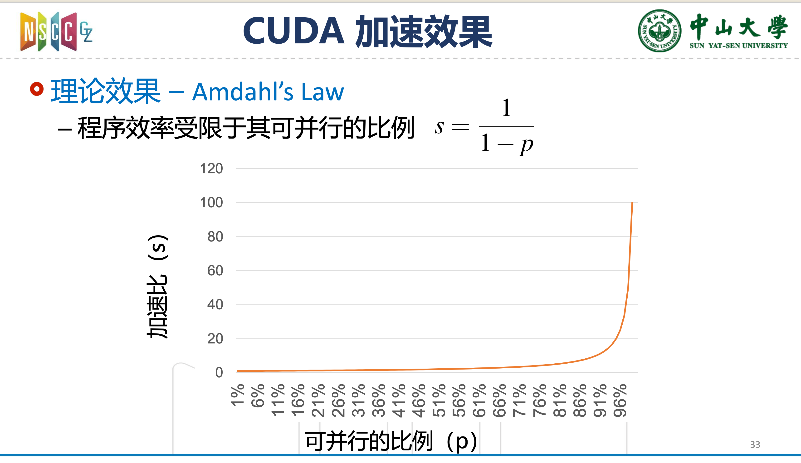

可以看到加速比和可并行的比例呈指数级的关系，之前程序基本上只有那一个计算的函数，可并行的比例极大，而sift却不同，我们只优化了构建金字塔的部分，从计算时间上来讲这一部分只占65%左右。故我们的15左右的加速比也是在合理范围之内的。


## 八、遇到的问题

- CPU实现
    - 高斯金字塔构建：在下采样之后，对哪张图片进行何种高斯模糊操作，才能使得第i层相对于输入图片有$\sigma_i$的高斯模糊：通过阅读opencv的SIFT实现，发现可以用级联高斯操作，对上一层图片进行$\sigma=\sqrt{\sigma_i^2-\sigma_{i-1}^2}$的高斯模糊，得到所需的图层
    - 各种内存越界
- 单元测试：共享库的生成、在Python中的调用、数据转换等等
- GPU加速：
    - 核函数中的exp结果溢出：发现是exp里面的一个变量由unsigned int 减去int得到，本应是负值的结果在unsigned int中下溢出到了非常大的正数，使得exp的结果溢出
    - 在GPU上的基础上使用OpenMP没有效果：通过在循环中打印有序数值，发现输出乱序结果，说明确实有多线程，没有效果的原因可能是这些线程都使用同一个GPU，资源有限，所以并没有比单个线程好很多，如果能在多GPU上运行，可能效果更加明显
    - 各种内存越界

## 九、实验不足与可改进之处

- 核函数还有进一步优化空间
- 只针对优化了构建金字塔的部分，后面的函数也可以优化
- 没有用下游任务来验证SIFT的正确性

## 附录


### Ⅰ. 附录1：SIFT CPU及其优化思路

#### 一、 SIFT on CPU

##### 1. 构建高斯金字塔

这一步需要构建高斯金字塔，作为图像的尺度空间表示。高斯金字塔由多个octave组成，每个octave包含S+3层图像，第一个octave的第一层图像由原图2倍上采样得到，此后每个octave的第一层图像由上一个octave的第S层1/2倍下采样得到，每个octave中，下一层由上一层进行高斯模糊得到，它们相对于原图的高斯模糊参数是以$2^{1/S}$为间隔连续的。高斯差分金字塔的每个octave由高斯金字塔的每个octave的每相邻两层的后一层减去前一层得到。


###### 上采样

SIFT的高斯金字塔的第一个octave的第一层表示已经是经过高斯模糊的，为了保留原图的最高频信息，可以在模糊之前对原图进行一次上采样（双线性插值）：

```c++
/******************************************************************
/*	函数: double_sample
/*	函数描述:对图像进行2倍上采样（图像的双线性插值）
/*	参数描述:
/*		img_src：原图像地址
/*		img_dst_ptr：保存上采样图像的地址的指针
/*  	n、m：图像高、宽，更新为上采样图像的大小
/********************************************************************/
void double_sample(const gray_t* img_src, gray_t** img_dst_ptr, int* n, int* m) {
	int scale_x = 2, scale_y = 2;
    int nv = *n, mv = *m;
	int nn = scale_x * nv, nm = scale_y * mv;
    gray_t* img_dst = new gray_t[nn * nm];
    *img_dst_ptr = img_dst;
	for (int dst_x = 0; dst_x < nn; ++dst_x) {
		for (int dst_y = 0; dst_y < nm; ++dst_y) {
			// 中心对齐
			double src_x = (dst_x + 0.5) / scale_x - 0.5;
			double src_y = (dst_y + 0.5) / scale_y - 0.5;
			int src_i = int(src_x);
			int src_j = int(src_y);
            // 双线性插值 原理参考https://blog.csdn.net/qq_37577735/article/details/80041586
			img_dst[dst_x * nm + dst_y] = \
				(src_i + 1  - src_x) * (src_j + 1 - src_y) * img_src[src_i * mv + src_j] \
				+ (src_i + 1  - src_x) * (src_y - src_j) * img_src[src_i * mv + src_j + 1] \
				+ (src_x - src_i) * (src_j + 1 - src_y) * img_src[(src_i + 1) * mv + src_j] \
				+ (src_x - src_i) * (src_y - src_j) * img_src[(src_i + 1) * mv + src_j + 1];
		}
	}
	*n = nn;
	*m = nm;
}
```

- 单元测试：

<center class="half">     </center>

- 单元测试结果分析：左图为原图，右图为上采样后的图片，可见图片内容一致，而图片的高度、宽度都变为2倍（见横纵坐标），与预期结果一致。

###### 下采样

```c++
/******************************************************************
/*	函数: half_sample
/*	函数描述:对图像进行1/2下采样
/*	参数描述:
/*		img_src：原图像地址
/*		img_dst_ptr：保存下采样图像的地址的指针
/*  	n、m：图像高、宽，更新为下采样图像的大小
/********************************************************************/
void half_sample(const gray_t* img_src, gray_t** img_dst_ptr, int* n, int* m) {
    int nv = *n, mv = *m;
    int nn = nv / 2, nm = mv / 2;
    gray_t* img_dst = new gray_t[nn * nm];
    *img_dst_ptr = img_dst;
    for (int i = 0; i < nn; ++i) {
        for (int j = 0; j < nm; ++j) {
            // SIFT中的1/2下采样方法：每个维度上每隔两个像素取一个像素
            img_dst[i * nm + j] = img_src[(i << 1) * mv + (j << 1)];
        }
    }
    *n = nn;
    *m = nm;
}
```

- 单元测试：

<center class="half">     </center>

- 单元测试结果分析：左图为原图，右图为下采样后的图片，可见图片内容一致，而图片的高度、宽度都变为1/2倍（见横纵坐标），与预期结果一致。

###### 高斯模糊

在高斯模糊的实现中，使用两次一维卷积代替二维卷积，可将复杂度从 `O(m*n*filter_size*filter_size)` 降为 `O(m*n*filter_size)`，当然还有进一步优化的空间，见2.1节。

```c++
/******************************************************************
/*	函数: guassian_smooth
/*	函数描述:对图像进行高斯模糊，平滑参数为sigma，结果保存到img_dst
/*	参数描述:
/*		img_src：原图像地址
/*		img_dst_ptr：保存平滑图像的地址的指针
/*  	n、m：图像高、宽（平滑操作不改变图像大小）
/*  	sigma：高斯模糊参数
/********************************************************************/
void guassian_smooth(const gray_t* img_src, gray_t** img_dst_ptr, int n, int m, double sigma) {
    gray_t* img_dst = new gray_t[n * m];
    *img_dst_ptr = img_dst;
    // 卷积核：用两次一维卷积分离实现二维卷积 复杂度从 O(m*n*filter_size*filter_size) 降为 O(m*n*filter_size)
    // 1. 根据sigma确定卷积核大小 原理参考https://www.cnblogs.com/shine-lee/p/9671253.html “|1”是为了取邻近的奇数
    int filter_size = int(sigma * 3 * 2 + 1) | 1;
    gray_t* filter = new gray_t[filter_size];
    // 2. 根据高斯分布确定卷积核参数
    int mid = filter_size >> 1;
    double total = 0;
    for (int i = 0; i < filter_size; ++i) {
        filter[i] = 1 / (sqrt(2 * PI) * sigma) * exp((- (i - mid) * (i - mid)) / (2 * sigma * sigma));
        total += filter[i];
    }
    for (int i = 0; i < filter_size; ++i) {
        filter[i] /= total;
    }
    // 卷积（卷积核越界部分使用边界填充，保持图片大小不变）
    gray_t* temp_res = new gray_t[n * m];  // 存储进行第一维卷积后的结果
    // 1. 进行第一维卷积
    for (int j = 0; j < m; ++j) {
        for (int i = 0; i < n; ++i) {
            int pos = i * m + j;
            temp_res[pos] = 0;
            for (int fi = 0; fi < filter_size; ++fi) {
                int xi = i + (fi - mid);
                xi = xi < 0 ? 0 : xi;
                xi = xi >= n ? n-1: xi;
                temp_res[pos] += filter[fi] * img_src[xi * m + j];
            }
        }
    }
    // 2. 进行第二维卷积
    for (int i = 0; i < n; ++i) {
        for (int j = 0; j < m; ++j) {
            int pos = i * m + j;
            img_dst[pos] = 0;
            for (int fi = 0; fi < filter_size; ++fi) {
                int yi = j + (fi - mid);
                yi = yi < 0 ? 0 : yi;
                yi = yi >= m ? m-1: yi;
                img_dst[pos] += filter[fi] * temp_res[i * m + yi];
            }
        }
    }
    delete[] filter;
    delete[] temp_res;
}
```

- 单元测试：

<center class="half">     </center>

- 单元测试结果分析：取sigma=10，左图为上述程序结果，右图为opencv结果，可见图片内容比较接近

    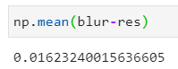

    ，说明上述实现基本没有问题，且实测当sigma较大时，用两次一维卷积代替一次二维卷积的速度提升很明显。

###### 高斯金字塔

```c++
/******************************************************************
/*	函数: build_Gauss_pyramid
/*	函数描述: 构建图像的高斯金字塔层
/*	参数描述:
/*		double_sample_img：输入图像
/*		Gauss_pyramid：保存高斯层的vector容器
/*  	n,m：输入图像大小
/*  	S：中间层数（每个octave是S+3层）
/*  	sigma_init：第一层使用的高斯模糊参数
/********************************************************************/
void build_Gauss_pyramid(gray_t* gray_img, int n, int m, std::vector<Layer>& Gauss_pyramid, int S, double sigma_init) {
    // 至少3*3
    double sigma = sigma_init; // 记录下一层的相对于 原始上采样图像 的平滑参数
    double rela_sigma; // 下一层由当前层以rela_sigma的高斯平滑得到 相当于以sigma从 原始上采样图像 的高斯平滑得到
    double s_rt_2 = pow(2, 1.0 / S); // sigma(i+1) = sigma(i) * s_rt_2 注意1/S是整数0 
    double s_mul = sqrt(s_rt_2 * s_rt_2 - 1); // rela_sigma = sqrt((sigma(i) * s_rt_2) ^ 2 - sigma(i) ^ 2) = sigma(i) * s_mul
    gray_t* cur_img;
    for (int octave = 0; n >= 3 && m >= 3; ++octave) {
        if (octave == 0) {
            // 第一个octave的第一层 将输入图像上采样后进行高斯模糊
            double_sample(gray_img, &gray_img, &n, &m);
            guassian_smooth(gray_img, &cur_img, n, m, sigma);
            delete[] gray_img; // 删除上采样图像
            gray_img = nullptr;
            Gauss_pyramid.push_back(Layer(cur_img, n, m, sigma));
        }
        else {
            // 第二个及之后octave的第一层 从上一个octave的第S层下采样得到
            int last_oct_S = octave * (S + 3) - 3;
            half_sample(Gauss_pyramid[last_oct_S].img, &cur_img, &n, &m);
            sigma = Gauss_pyramid[last_oct_S].sigma;
            Gauss_pyramid.push_back(Layer(cur_img, n, m, sigma));
        }
        rela_sigma = sigma * s_mul;
        sigma *= s_rt_2;
        // 每个octave的后续layer
        for (int layer = 1; layer < S + 3; ++layer) {
            guassian_smooth(cur_img, &cur_img, n, m, rela_sigma);
            Gauss_pyramid.push_back(Layer(cur_img, n, m, sigma));
            rela_sigma = sigma * s_mul;
            sigma *= s_rt_2;
        }
    }
}
```

- 单元测试：S=1，即octave大小为S+3=4所构建金字塔的前3个octave

<table>
    <tr>
        <td ><center>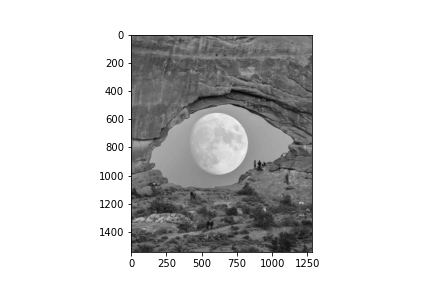 </center>第一个octave</td>
        <td ><center>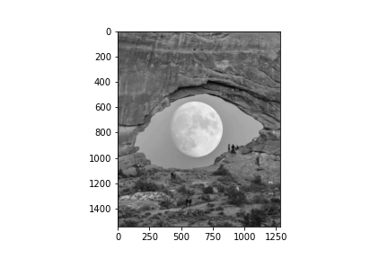 </center></td>
        <td ><center> </center></td>
        <td ><center> </center></td>
    </tr>
	<tr>
        <td ><center> </center>第二个octave</td>
        <td ><center> </center></td>
        <td ><center>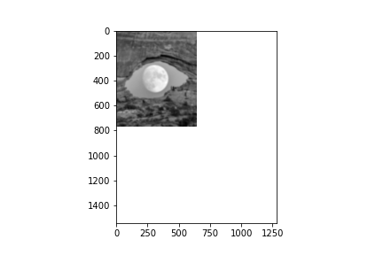 </center></td>
        <td ><center>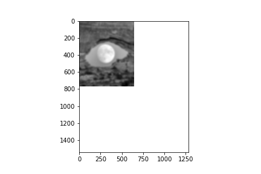 </center></td>
    </tr>
    	<tr>
        <td ><center> </center>第三个octave</td>
        <td ><center> </center></td>
        <td ><center> </center></td>
        <td ><center>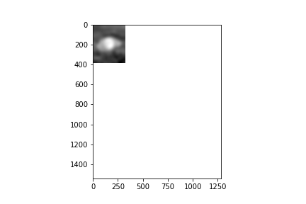 </center></td>
    </tr>
</table>
###### 高斯差分金字塔

```c++
/******************************************************************
/*	函数: build_DoG_pyramid
/*	函数描述: 构建图像的高斯差分金字塔层
/*	参数描述:
/*		Gauss_pyramid：输入高斯金字塔层
/*		DoG_pyramid：保存高斯差分层的vector容器
/*  	S：中间层数（每个octave是S+3层）
/********************************************************************/
void build_DoG_pyramid(std::vector<Layer>& Gauss_pyramid, std::vector<Layer>& DoG_pyramid, int S) {
    int n_layer = Gauss_pyramid.size();
    for (int layer = 0; layer < n_layer; layer += S + 3) {
        int n = Gauss_pyramid[layer].n, m = Gauss_pyramid[layer].m;
        for (int layeri = layer + 1; layeri < layer + S + 3; ++ layeri) {
            gray_t* dog_img = new gray_t[n * m];
            for (int i = 0; i < n * m; ++i) {
                dog_img[i] = Gauss_pyramid[layeri].img[i] - Gauss_pyramid[layeri - 1].img[i];
            }
            DoG_pyramid.push_back(Layer(dog_img, n, m, Gauss_pyramid[layeri - 1].sigma));
        }
    }
}
```

- 单元测试：S=1时的差分金字塔的第一个octave

<table>
    <tr>
        <td ><center>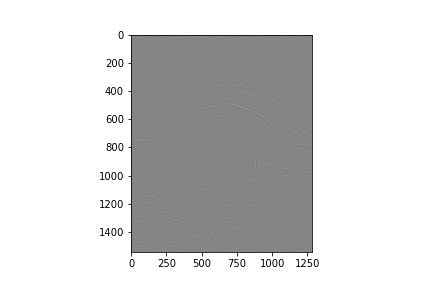 </center></td>
        <td ><center>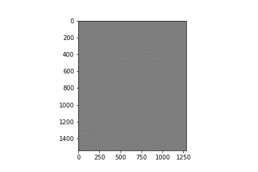 </center></td>
        <td ><center> </center></td>
    </tr>
</table>
##### 2. 极值点检测

```c++
/******************************************************************
/*	函数: detect_keypoints
/*	函数描述: 从高斯差分金字塔中检测极值点
/*	参数描述:
/*		DoG_pyramid：输入的高斯差分金字塔
/*		keypoints：保存极值点
/*  	S：中间层数（每个dog octave是S+2层）
/*  	contrast_threshold：用于低对比度样本点过滤的阈值大小 如0.03
/*  	edge_response_threshold：用于边缘响应样本点过滤的阈值大小 如10
/*  	max_iterpolation：最大变换插值次数
/********************************************************************/
void detect_keypoints(std::vector<Layer>& DoG_pyramid, std::vector<KeyPoint>& keypoints, int S, double contrast_threshold, double edge_response_threshold, int max_iterpolation) {
    int n_layer = DoG_pyramid.size();
    int octave = 0;
    for (int layer = 0; layer < n_layer; layer += S + 2) {
        int n = DoG_pyramid[layer].n, m = DoG_pyramid[layer].m;
        for (int layeri = layer + 1; layeri < layer + S + 1; ++ layeri) {
            // 刚好S个中间层
            gray_t* prev_img = DoG_pyramid[layeri - 1].img;
            gray_t* cur_img = DoG_pyramid[layeri].img;
            gray_t* next_img = DoG_pyramid[layeri + 1].img;
            for (int i = 1; i < n-1; ++i) {
                for (int j = 1; j < m-1; ++j) {
                    gray_t cur = cur_img[i * m + j];
                    int x = 0, y, l;
                    // 如果小于它的9+8+9=26个邻居
                    if (cur < cur_img[(i - 1) * m + j - 1] && cur < cur_img[(i - 1) * m + j] && cur < cur_img[(i - 1) * m + j + 1]\
                           && cur < cur_img[i * m + j - 1] && cur < cur_img[i * m + j + 1]\
                           && cur < cur_img[(i + 1) * m + j - 1] && cur < cur_img[(i + 1) * m + j] && cur < cur_img[(i + 1) * m + j + 1]) {
                        if (cur < prev_img[(i - 1) * m + j - 1] && cur < prev_img[(i - 1) * m + j] && cur < prev_img[(i - 1) * m + j + 1]\
                               && cur < prev_img[i * m + j - 1] && cur < prev_img[i * m + j] && cur < prev_img[i * m + j + 1]\
                               && cur < prev_img[(i + 1) * m + j - 1] && cur < prev_img[(i + 1) * m + j] && cur < prev_img[(i + 1) * m + j + 1]) {
                            if (cur < next_img[(i - 1) * m + j - 1] && cur < next_img[(i - 1) * m + j] && cur < next_img[(i - 1) * m + j + 1]\
                               && cur < next_img[i * m + j - 1] && cur < next_img[i * m + j] && cur < next_img[i * m + j + 1]\
                               && cur < next_img[(i + 1) * m + j - 1] && cur < next_img[(i + 1) * m + j] && cur < next_img[(i + 1) * m + j + 1]) {
                                x = i, y = j, l = layeri - layer;
                            }
                        }
                    }
                    // 或者大于它的9+8+9=26个邻居
                    else if (cur > cur_img[(i - 1) * m + j - 1] && cur > cur_img[(i - 1) * m + j] && cur > cur_img[(i - 1) * m + j + 1]\
                           && cur > cur_img[i * m + j - 1] && cur > cur_img[i * m + j + 1]\
                           && cur > cur_img[(i + 1) * m + j - 1] && cur > cur_img[(i + 1) * m + j] && cur > cur_img[(i + 1) * m + j + 1]) {
                        if (cur > prev_img[(i - 1) * m + j - 1] && cur > prev_img[(i - 1) * m + j] && cur > prev_img[(i - 1) * m + j + 1]\
                               && cur > prev_img[i * m + j - 1] && cur > prev_img[i * m + j] && cur > prev_img[i * m + j + 1]\
                               && cur > prev_img[(i + 1) * m + j - 1] && cur > prev_img[(i + 1) * m + j] && cur > prev_img[(i + 1) * m + j + 1]) {
                            if (cur > next_img[(i - 1) * m + j - 1] && cur > next_img[(i - 1) * m + j] && cur > next_img[(i - 1) * m + j + 1]\
                               && cur > next_img[i * m + j - 1] && cur > next_img[i * m + j] && cur > next_img[i * m + j + 1]\
                               && cur > next_img[(i + 1) * m + j - 1] && cur > next_img[(i + 1) * m + j] && cur > next_img[(i + 1) * m + j + 1]) {
                               x = i, y = j, l = layeri - layer;
                            }
                        }
                    }
                    // 添加极值点
                    if (x != 0) {
                        interpolate_keypoints(DoG_pyramid, S, x, y, l, layer, contrast_threshold, edge_response_threshold, max_iterpolation);
                        if (x != 0) {
                            keypoints.push_back(KeyPoint(x, y, n, m, octave, l, DoG_pyramid[layer + l].sigma));
                        }
                    }
                }
            }
        }
        ++octave;
    }
}
```

其中的样本点插值函数如下：（`其中的三阶矩阵求导经验证，为正确`）

```c++
/******************************************************************
/*	函数: interpolate_keypoints
/*	函数描述: 对检测到的极值点进行插值更新、过滤
/*	参数描述:
/*		DoG_pyramid：输入的高斯差分金字塔
/*  	S：中间层数（每个dog octave是S+2层）
/*  	x，y，layeri，layer：样本点所在二维坐标、所在DoG层的octave内编号、与其所在octave的第一层在金字塔中的编号
/*  	contrast_threshold：用于低对比度样本点过滤的阈值大小 如0.03
/*  	edge_response_threshold：用于边缘响应样本点过滤的阈值大小 如10
/*  	max_iterpolation：最大变换插值次数
/********************************************************************/
void interpolate_keypoints(std::vector<Layer>& DoG_pyramid, int S, int& x, int& y, int& layeri, int layer, double contrast_threshold, double edge_response_threshold, int max_iterpolation) {
    int n = DoG_pyramid[layer + layeri].n, m = DoG_pyramid[layer + layeri].m;
    double ex_val; //极值
    double ratio; // 边缘响应
    double ratio_threshold = (edge_response_threshold + 1) * (edge_response_threshold + 1) / edge_response_threshold; // 边缘响应阈值
    double fxyl[3]; // 偏移量
    double he[9]; // hessian矩阵
    double he_inv[9]; // hessian矩阵的逆
    double dxyl[3]; // 一阶导
    gray_t* img[3];
    for (int i = 0; i < max_iterpolation; ++i) {
        img[0] = DoG_pyramid[layer + layeri - 1].img;
        img[1] = DoG_pyramid[layer + layeri].img;
        img[2] = DoG_pyramid[layer + layeri + 1].img;
        // 计算二阶导（hessian矩阵） 原理参考https://blog.csdn.net/saltriver/article/details/78990520
        int xy = x * m + y;
        he[0] = img[1][xy - m] + img[1][xy + m] - 2 * img[1][xy]; // Dxx
        he[4] = img[1][xy + 1] + img[1][xy - 1] - 2 * img[1][xy]; // Dyy
        he[8] = img[0][xy] + img[2][xy] - 2 * img[1][xy]; // Dll
        he[1] = he[3] = img[1][xy + m + 1] - img[1][xy + 1] - img[1][xy + m] + img[1][xy]; //Dxy
        he[2] = he[6] = img[2][xy + m] - img[2][xy] - img[1][xy + m] + img[1][xy]; //Dxl
        he[5] = he[7] = img[2][xy + 1] - img[2][xy] - img[1][xy + 1] + img[1][xy]; //Dyl
        // 计算hessian矩阵的逆 公式见https://blog.csdn.net/feixia_24/article/details/41644335
        double det = he[0] * (he[4] * he[8] - he[5] * he[7]) \
                - he[3] * (he[1] * he[8] - he[2] * he[7]) \
                + he[6] * (he[1] * he[5] - he[2] * he[4]);
        // assert det != 0
        he_inv[0] = (he[4] * he[8] - he[5] * he[7]) / det;
        he_inv[1] = (he[2] * he[7] - he[1] * he[8]) / det;
        he_inv[2] = (he[1] * he[5] - he[2] * he[4]) / det;
        he_inv[3] = (he[5] * he[6] - he[3] * he[8]) / det;
        he_inv[4] = (he[0] * he[8] - he[2] * he[6]) / det;
        he_inv[5] = (he[3] * he[2] - he[0] * he[5]) / det;
        he_inv[6] = (he[3] * he[7] - he[4] * he[6]) / det;
        he_inv[7] = (he[1] * he[6] - he[0] * he[7]) / det;
        he_inv[8] = (he[0] * he[4] - he[3] * he[1]) / det;
        // 计算一阶导
        dxyl[0] = img[1][xy + m] - img[1][xy]; // dx
        dxyl[1] = img[1][xy + 1] - img[1][xy]; // dy
        dxyl[2] = img[2][xy] - img[1][xy]; // dl
        // 计算偏移量
        fxyl[0] = - (he_inv[0] * dxyl[0] + he_inv[1] * dxyl[1] + he_inv[2] * dxyl[2]);
        fxyl[1] = - (he_inv[3] * dxyl[0] + he_inv[4] * dxyl[1] + he_inv[5] * dxyl[2]);
        fxyl[2] = - (he_inv[6] * dxyl[0] + he_inv[7] * dxyl[1] + he_inv[8] * dxyl[2]);
        // 计算极值
        ex_val = img[1][xy] + 0.5 * (dxyl[0] * fxyl[0] + dxyl[1] * fxyl[1] + dxyl[2] * fxyl[2]);
        // 计算边缘响应
        ratio = (he[0] + he[4]) * (he[0] + he[4]) / (he[4] * he[0] - he[3] * he[1]);
        // 1. 如果某一维大于0.5 则更新样本点后重新插值
        if (myabs(fxyl[0]) > 0.5 || myabs(fxyl[1]) > 0.5 || myabs(fxyl[2]) > 0.5) {
            x += int(fxyl[0] + 0.5);
            y += int(fxyl[1] + 0.5);
            layeri += int(fxyl[2] + 0.5);
            // 检查是否在合法样本点范围 如果不在 取消该样本点
            if (x < 1 || x > n - 2|| y < 1 || y > m - 2 || layeri < 1 || layeri > S) {
                break;
            }
        }
        // 2. 否则 如果极值小于阈值（低对比度） 取消该样本点
        else if (ex_val < contrast_threshold) {
            break;
        }
        // 3. 否则 如果边缘响应过大 取消该样本点
        else if (ratio > ratio_threshold) {
            break;
        }
        // 4. 否则 保留该样本点
        else {
            return;
        }
    }

    x = 0;
}
```

- 单元测试：检测、筛选后的样本点如下

  

##### 3. 方向赋值

```c++
/******************************************************************
/*	函数: assign_orient
/*	函数描述: 为样本点赋值主方向
/*	参数描述:
/*		Gauss_pyramid：输入的高斯金字塔
/*  	keypoints：已检测到的样本点
/*  	S：金字塔中每隔octave的中间层数
/********************************************************************/
void assign_orient(std::vector<Layer>& Gauss_pyramid, std::vector<KeyPoint>& keypoints, int S) {
    int old_size = keypoints.size();
    for (int ki = 0; ki < old_size; ++ki) {
        double bins[36] = {0};
        double sigma = 1.5 * keypoints[ki].sigma;
        int layer = keypoints[ki].octave * (S+3) + keypoints[ki].layer;
        gray_t* img = Gauss_pyramid[layer].img;
        int n = Gauss_pyramid[layer].n, m = Gauss_pyramid[layer].m;
        int x = keypoints[ki].x, y = keypoints[ki].y;
        int win_radius = (int(sigma * 3 * 2 + 1) | 1) >> 1; // 高斯权重窗口
        // 统计高斯窗口内的梯度方向分布（将360度划分为36个bins），每个像素的梯度权重为其梯度大小乘以高斯权重大小
        for (int i = - win_radius; i <= win_radius; ++i) {
            for (int j = - win_radius; j <= win_radius; ++j) {
                int xi = i + x, yj = j + y;
                if (xi > 0 && xi < n - 1 && yj > 0 && yj < m - 1) {
                    double dx = img[(xi + 1) * m + yj] - img[(xi - 1) * m + yj];
                    double dy = img[xi * m + yj + 1] - img[xi * m + yj - 1];
                    double magnitude = sqrt(dx * dx + dy * dy);
                    double gaussian = 1/ (2 * PI * sigma * sigma) * exp(- (i * i + j * j) / (2 * sigma * sigma));
                    // dy有可能等于0 需要加上eps数值稳定
                    int theta = (int)((atan(dx / (dy + EPS)) * 180 / PI) + 180);
                    bins[theta /  10] += gaussian * magnitude;
                }
            }
        }
        // 梯度值最大的作为主方向
        double max_theta_val = bins[0];
        int max_theta = 0;
        for (int i = 1; i < 36; ++i) {
            if (bins[i] > max_theta_val) {
                max_theta = i * 10; // 单位：度
                max_theta_val = bins[i];
            }
        }
        keypoints[ki].ori = max_theta;
        // 增强稳定性：大于主方向的梯度值的80%的那些方向也用于创建新的样本点 分别以这些方向为主方向
        for (int i = 1; i < 36; ++i) {
            if (bins[i] > 0.8 * max_theta_val) {
                KeyPoint dup_key(keypoints[ki]);
                dup_key.ori = i * 10;
                keypoints.push_back(dup_key);
            }
        }
    }
}
```

##### 4. 特征生成

```c++
/******************************************************************
/*	函数: generate_features
/*	函数描述: 生成样本点的特征描述
/*	参数描述:
/*		Gauss_pyramid：高斯金字塔
/*  	keypoints：已检测到的样本点
/*  	kr：样本点所在region的大小为kr x kr
/*  	ks: region划分为ks x ks个subregion
/*  	ko：描述每个subregion的方向直方图的bins个数（均匀划分360度）
/*  	S：金字塔中每隔octave的中间层数
/********************************************************************/
void generate_features(std::vector<KeyPoint>& keypoints, std::vector<Layer>& Gauss_pyramid, int kr, int ks, int ko, int S) {
    int key_size = keypoints.size();
    // assert kr % ks = 0
    int rs = kr / ks; // subregion为rsxrs大小
    int radius =  kr >> 1; // region的半径 即region为(2radius)x(2radius)
    int f_size = ks * ks * ko; // 特征的维度
    double bs = 360.0 / ko;  // 方向直方图每个bin的区间长度
    for (int ki = 0; ki < key_size; ++ki) {
        int layer = keypoints[ki].octave * (S+3) + keypoints[ki].layer;
        gray_t* img = Gauss_pyramid[layer].img;
        int n = keypoints[ki].n, m = keypoints[ki].m;
        int x = keypoints[ki].x, y = keypoints[ki].y;
        int ori = keypoints[ki].ori;
        double sigma = 1.5 * kr;
        double* feature = new double[f_size];
        // 初始化所有直方图
        for (int i = 0; i < f_size; ++i) {
            feature[i] = 0;
        }
        for (int si = 0; si < ks; ++ si) {
            for (int sj = 0; sj < ks; ++sj) {
                // 第sub个（行优先）subregion
                double* sub_feature = feature + (si * ks + sj) * ko; 
                // 左上角坐标为(xsi, ysj)
                int xsi = x - radius + si * rs;
                int ysj = y - radius + sj * rs;
                // 统计该subregion中的梯度方向信息 所有subregion的直方图拼接为feature
                for (int i = xsi; i < xsi + rs; ++i) {
                    for (int j = ysj; j < ysj + rs; ++j) {
                        if (i > 0 && i < n - 1 && j > 0 && j < m - 1) {
                            // 当前像素的图像梯度
                            double dx = img[(i + 1) * m + j] - img[(i - 1) * m + j];
                            double dy = img[i * m + j + 1] - img[i * m + j - 1];
                            double magnitude = sqrt(dx * dx + dy * dy);
                            // 当前像素的高斯权重
                            int di = i - x, dj = j - y;
                            double gaussian = 1/ (2 * PI * sigma * sigma) * exp(- (di * di + dj * dj) / (2 * sigma * sigma));
                            // 当前像素的相对于主方向的方向
                            // dy有可能等于0 需要加上eps数值稳定
                            int theta = atan(dx / (dy + EPS)) * 180 / PI + 180 - ori;
                            int b = int(theta / bs + 0.5);
                            sub_feature[b] += magnitude * gaussian;
                        }
                    }
                }
            }
        }
        // 归一化
        double total = 0;
        for (int i = 0; i < f_size; ++i) {
            total += feature[i];
        }
        for (int i = 0; i < f_size; ++i) {
            feature[i] /= total;
        }
        // 限制最大值为0.2
        for (int i = 0; i < f_size; ++i) {
            feature[i] = feature[i] > 0.2 ? 0.2 : feature[i];
        }
        // 再归一化
        total = 0;
        for (int i = 0; i < f_size; ++i) {
            total += feature[i];
        }
        for (int i = 0; i < f_size; ++i) {
            feature[i] /= total;
        }
        
        keypoints[ki].feature = feature;
        keypoints[ki].feat_len = f_size;
    }
}
```

#### 二、优化思路

通过测试发现，第一阶段（高斯金字塔的构建）耗时远高于其他阶段，因此我们主要优化该阶段中的操作。

卷积、扫描、规约的gpu实现的单元测试见test\_scan.cu文件

##### 1. 卷积的CPU优化

在高斯金字塔的构建中，每个octave需要一次上采样或下采样操作，以及S+2次高斯模糊（卷积），而上采样、下采样的复杂度为$O(nm)$，使用**两次一维卷积代替二维卷积的优化**后的高斯模糊的复杂度仍有$O(mnk)$，其中$k$为卷积核大小，由高斯参数$\sigma$计算得到：
$$
k = \lfloor 6\sigma + 1\rfloor|1
$$
而第$o$个octave的第一层相对于原始图像的高斯模糊参数为：
$$
\sigma_o = 2^o\sigma_0
$$
所以卷积中的$k$也随着$o$的增长而指数增长，对此SIFT也采取了措施，即每个octave的图像大小$m,n$都是上一个octave的一半，所以z高斯模糊的复杂度$O(mnk)$不会随着$o$的增长而指数增长，而是指数下降。

这虽然意味着我们不需要对卷积操作的复杂度进行数量级上的优化，但是并不妨碍我们对其进行常数级的优化。比如，在每次一维卷积中，当卷积范围在图片中越界时，越界部分都采用边界值$b$填充，假设在一边有$c$个参数$f[1]...f[c]$越界，那么本需要计算$\sum_i^c(f[i]\cdot b)$，即$c$次乘法和加法，如果预先计算好$\sum_i^cf[i]$，就只需要一次乘法。此外，由于高斯卷积核的对称性，卷积核只需原始的一半空间。具体优化如下：

```c++
void guassian_smooth(const gray_t* img_src, gray_t** img_dst_ptr, int n, int m, double sigma) {
    gray_t* img_dst = new gray_t[n * m];
    *img_dst_ptr = img_dst;
    // 卷积核：用两次一维卷积分离实现二维卷积 复杂度从 O(m*n*filter_size*filter_size) 降为 O(m*n*filter_size)
    // 1. 根据sigma确定卷积核大小 原理参考https://www.cnblogs.com/shine-lee/p/9671253.html “|1”是为了取邻近的奇数
    int filter_size = int(sigma * 3 * 2 + 1) | 1;
    // 2. 根据高斯分布确定卷积核参数
    int mid = filter_size >> 1;
    gray_t* filter = new gray_t[mid + 1]; // 因为高斯卷积核的对称性 所以只存储前一半加一个参数
    gray_t* pre_filter = new gray_t[mid + 1]; // pre_filter[i]表示sum(filter[0], ..., filter[i])
    double total = 0;
    for (int i = 0; i < mid + 1; ++i) {
        filter[i] = 1 / (sqrt(2 * PI) * sigma) * exp((- (i - mid) * (i - mid)) / (2 * sigma * sigma));
        total += 2 * filter[i];
    }
    total -= filter[mid];
    for (int i = 0; i < mid + 1; ++i) {
        filter[i] /= total;
    }
    pre_filter[0] = filter[0];
    for (int i = 1; i < mid + 1; ++i) {
        pre_filter[i] = filter[i] + pre_filter[i - 1];
    }
    
    // 卷积（卷积核越界部分使用边界填充，保持图片大小不变）
    gray_t* temp_res = new gray_t[n * m];  // 存储进行第一维卷积后的结果
    // 1. 进行第一维卷积
    for (int j = 0; j < m; ++j) {
        for (int i = 0; i < n; ++i) {
            int pos = i * m + j;
            temp_res[pos] = 0;
            int i_sta = i - mid;
            int i_end = i + mid;
            // 当前行的卷积范围：[i-mid, i+mid]
            if (i - mid < 0) {
                // 合并计算[i-mid, 0)部分，即原filter的前mid-i个参数与mid-i个填充值（列首元素）的点乘
                temp_res[pos] += pre_filter[mid - i - 1] * img_src[j];
                i_sta = 0;
            }
            if (i + mid >= n) {
                // 合并计算(n-1, i+mid] 部分，即原filter的后xx=i+mid+1-n个参数（由于对称性 等价于前xx个）与xx个填充值（行尾元素）的点乘
                temp_res[pos] += pre_filter[i + mid - n] * img_src[(n - 1) * m + j];
                i_end = n - 1;
            }
            for (int xi = i_sta; xi <= i_end; ++xi) {
                // 第xi个元素离卷积中心i的距离为xi-i 使用的是距离卷积核中心mid距离为xi-i的卷积参数
                temp_res[pos] += filter[mid - myabs(i - xi)] * img_src[xi * m + j];
            }
        }
    }
    // 2. 进行第二维卷积
    for (int i = 0; i < n; ++i) {
        for (int j = 0; j < m; ++j) {
            int pos = i * m + j;
            img_dst[pos] = 0;
            int j_sta = j - mid;
            int j_end = j + mid;
            // 当前行的卷积范围：[j-mid, j+mid]
            if (j - mid < 0) {
                // 合并计算[j-mid, 0)部分，即原filter的前mid-j个参数与mid-j个填充值（行首元素）的点乘
                img_dst[pos] += pre_filter[mid - j - 1] * temp_res[i * m];
                j_sta = 0;
            }
            if (j + mid >= m) {
                // 合并计算(m-1, j+mid] 部分，即原filter的后xx=j+mid+1-m个参数（由于对称性 等价于前xx个）与xx个填充值（行尾元素）的点乘
                img_dst[pos] += pre_filter[j + mid - m] * temp_res[i * m];
                j_end = m - 1;
            }
            for (int yj = j_sta; yj <= j_end; ++yj) {
                // 第yj个元素离卷积中心j的距离为yj-j 使用的是距离卷积核中心mid距离为yj-j的卷积参数
                img_dst[pos] += filter[mid - myabs(j - yj)] * temp_res[i * m + yj];
            }
        }
    }

    delete[] filter;
    delete[] temp_res;
}
```

该优化使单次卷积的复杂度降为$O(mn\cdot \max(\min(m, k), \min(n, k)))$

##### 2. 卷积的CUDA优化思路

卷积在CPU上的上述优化也为CUDA优化提供了便利，比如，如果将$n,m$上的外层循环用CUDA并行化，那么原始算法的内存循环次数$k$过多，使得单个CUDA线程的任务量过大，占用资源过多，从而降低活跃线程数数量，不足以掩盖延迟。而优化后的算法显著降低了内层循环次数，因为在前面的octave中，$\sigma$很小，所以$k$也比较小，在后面的octave中，$n,m$很小，因此内层循环次数$\max(\min(m, k), \min(n, k))$始终较小。

##### 3. <span id="omp">单个octave构建的OpenMP优化思路</span>

在上述实现的高斯金字塔构建算法中，每一个octave的第一层由上一个octave的第S层下采样得到，因此下一个octave的构建依赖于前一个octave的构建。由于上一个octave的第S层是由上一个octave的第1层不断高斯模糊得到的，所以不能在构建完上一个octave的第S层之前开始构建下一个octave，因此无法并行开始每个octave的构建。

在每个octave内部，第$i$层由第$i-1$层进行高斯模糊得到（参数为$\sigma_{oi} = \sqrt{(2^{i/S}\sigma_o)^2 - (2^{(i-1)/S}\sigma_o)^2} = 2^{(i-1)/S}\sigma_o\sqrt{2^{2/S}-1}$），)（这里使用了高斯卷积的级联性质，参考[^3]）使得其相对于原始上采样图片的模糊参数分别为：
$$
\sigma_o,2^{1/S}\sigma_o,2^{2/S}\sigma_o,2^{3/S}\sigma_o,2^{4/S}\sigma_o,...
$$
这样每一层的生成都对前一层的生成有依赖，无法并行。

为此，我们可以让octave内部，第$i$层由第$1$层直接进行高斯模糊得到（参数为$\sigma_{oi} = \sqrt{(2^{i/S}\sigma_o)^2 - \sigma_o^2} = \sigma_o\sqrt{2^{2i/S}-1}$），这样虽然使得每个$\sigma_{oi}$增大了（比例为$\frac{\sqrt{2^{2i/S}-1}}{\sqrt{2^{2i/S}-2^{2(i-1)/S}}}=\sqrt{\frac{2^{2/S}-2^{-2(i-1)/S}}{2^{2/S}-1}}$），使得每次卷积的复杂度增加，但是好处是每一层可以独立生成，由于生成的计算比较复杂，所以可以考虑用OpenMP进行并行，带来几倍加速。我们期待octave内部层数$S$较大时，该并行方法可以实现加速。

```c++
        //每个octave的后续layer：前后独立实现 每一层直接从octave的第一层模糊得到
        for (int layer = 1; layer < S + 3; ++layer) {
            Gauss_pyramid.push_back(Layer(nullptr, n, m, sigma));
            sigma *= s_rt_2;
        }
        int oct_layer = octave * (S + 3);

        for (int layer = 1; layer < S + 3; ++layer) {
            guassian_smooth(Gauss_pyramid[oct_layer].img, &Gauss_pyramid[oct_layer + layer].img, n, m, Gauss_pyramid[oct_layer].sigma * sqrt(pow(2, 2.0 * layer / S) - 1));
        }
```

##### <span id="you">4. 显存拷贝优化思路</span>

当我们把卷积计算放到CUDA上时，需要将被卷积的图片拷贝到设备上，将卷积结果拷贝回主机，这样虽然卷积计算的时间减少了，但是额外增加了内存拷贝的时间。仔细分析高斯金字塔构建的过程，可以发现，如果一开始就把图层放到显存上（每个layer记录一个img指针指向显存），那么每次卷积都不需要内存拷贝。这还带来一个好处是其他操作也可以在GPU上加速（而免受内存拷贝带来的负优化），比如我们也将下采样操作在GPU上实现。

不过由于我们只对高斯金字塔的构建进行加速，后续的操作都需要在CPU上进行，所以在高斯金字塔构建完成之后，还需要将所有图层从显存拷贝回来。即使这样，拷贝次数也缩减为原来的一半。如果有机会将后续操作都放在GPU上实现，那么就不用拷贝回来（我们只需要最后的样本点及其特征描述）。拷贝回来的操作如下：

```c++
void copy_back (std::vector<Layer>& Gauss_pyramid) {
    int g_size = Gauss_pyramid.size();
    for (int gi = 0; gi < g_size; ++gi) {
        gray_t* device_img = Gauss_pyramid[gi].img;
        Gauss_pyramid[gi].img = new gray_t[Gauss_pyramid[gi].n * Gauss_pyramid[gi].m];
        checkCudaErrors(cudaMemcpy(Gauss_pyramid[gi].img, device_img, sizeof(gray_t) * (Gauss_pyramid[gi].n * Gauss_pyramid[gi].m), cudaMemcpyDeviceToHost));
        checkCudaErrors(cudaFree(device_img));
    }
}
```


##### 5. 卷积核计算的规约与扫描优化

前面提到，在后面的octave中，卷积核大小会比较大，**此时**可以将卷积核参数的计算也用CUDA加速，额外的好处是卷积核可以直接在显存上申请，无需内存拷贝即可用于卷积。

在我们的卷积实现中，需要的卷积核参数及其计算过程、优化思路如下：

- filter：高斯卷积核的前$\lfloor k/2\rfloor + 1$个参数（后续参数与前一半对称）
  - 计算过程：计算每个位置高斯函数值，对所有高斯函数值求和（由于对称性，和为前$\lfloor k/2\rfloor$个值的和的两倍加上第$\lfloor k/2\rfloor + 1$个值），对已有值进行归一化
  - 优化思路：基于CUDA8.pdf的规约算法进行修改

```c++
__global__ void cal_filter(gray_t* filter, gray_t* total, int mid, double sigma) {
    extern __shared__ gray_t sdata[];
    // 计算filter
    int fi = blockIdx.x * blockDim.x + threadIdx.x;  // not unsigned int
    int tidx = threadIdx.x;
    if (fi <= mid) {
        filter[fi] = 1 / (sqrt(2 * PI) * sigma) * exp((- (fi - mid) * (fi - mid)) / (2 * sigma * sigma));
    }
    if (tidx == 0) {
        total[0] = 0.0;
    }
    __syncthreads(); // 确保当前线程块所需的filter计算完毕
    
    // 将filter加载到共享内存
    sdata[tidx] = fi <= mid ? filter[fi] : 0;
    __syncthreads();
    
    // 规约：把当前线程块的filter之和存放到共享内存sdata[0]
    for (unsigned int s = blockDim.x / 2; s > 0; s >>= 1) {
        if (tidx < s) {
            sdata[tidx] += sdata[tidx + s];
        }
        __syncthreads();
    }
    
    // 把所有线程块结果用原子加法累加到全局变量total[0]上
    if (tidx == 0) {
        atomicAdd(total, 2.0 * sdata[0]);
    }
    if (fi == mid) {
        atomicAdd(total, - filter[mid]);
    }
}

__global__ void div_filter(gray_t* filter, gray_t* total, int mid, int loop) {
    // 计算filter
    int fi = blockIdx.x * blockDim.x + threadIdx.x;
    int sta = fi * loop;
    int end = mymin(sta + loop, mid + 1);
    for (int i = sta; i < end; ++i) {
        filter[i] /= total[0];
    }
}
```

```c++
// 计算filter的完整调用
		gray_t* device_total;
        checkCudaErrors(cudaMalloc((void **) &device_total, sizeof(gray_t)));
        cal_filter<<<diveup((mid + 1), 32), 32, sizeof(gray_t)*32>>>(device_filter, device_total, mid, sigma);
        checkCudaErrors(cudaDeviceSynchronize());
        div_filter<<<diveup((mid + 1), 32 * 8), 32>>>(device_filter, device_total, mid, 8);
        checkCudaErrors(cudaDeviceSynchronize());
        checkCudaErrors(cudaFree(device_total));
```

- pre_filter：filter的前缀和
  - 优化思路：使用CUDA7.pdf的扫描算法求前缀和

```c++
// from CUDA7.pdf
// 计算 每个block内部的前缀和 并记录block sum（block内前缀和数组的最后一个值）的前缀和
__global__ void scan(gray_t* out, gray_t* block_sums, gray_t* data) {
    extern __shared__ gray_t s_data[];
    int tid = blockIdx.x * blockDim.x + threadIdx.x;
    s_data[threadIdx.x] = data[tid];

    for (int stride = 1; stride < blockDim.x; stride <<= 1) {
        __syncthreads();
        gray_t val = (threadIdx.x >= stride) ? s_data[threadIdx.x - stride] : 0;
        __syncthreads();
        s_data[threadIdx.x] += val;
    }

    out[tid] = s_data[threadIdx.x];
    if (threadIdx.x == 0) {
        for (int i = blockIdx.x + 1; i < gridDim.x; ++i) {
            atomicAdd(&block_sums[i], s_data[blockDim.x - 1]);
        } 
    }
}

// 将blocksum前缀和添加到block内部前缀和的每一项
__global__ void scan_update(gray_t* out, gray_t* block_sums) {
    __shared__ gray_t block_sum;
    int idx = blockIdx.x * blockDim.x + threadIdx.x;

    if (threadIdx.x == 0) {
        block_sum  = block_sums[blockIdx.x];
    }

    __syncthreads();

    out[idx] += block_sum;
}
```

```c++
// 计算pre_filter的完整调用
        gray_t* block_sums;
        int block_num = diveup(mid + 1, 32);
        checkCudaErrors(cudaMalloc((void **) &block_sums, sizeof(gray_t) * (block_num)));
        scan<<<block_num, 32, 32>>>(device_pre_filter, block_sums, device_filter);
        checkCudaErrors(cudaDeviceSynchronize());
        scan_update<<<block_num, 32>>>(device_pre_filter, block_sums);
        checkCudaErrors(cudaDeviceSynchronize());
        checkCudaErrors(cudaFree(block_sums));
```

上述代码中使用了双精度的atomicAdd，在V100上需要用-arch=sm_70编译


### Ⅱ. 附录2告：优化过程说明

#### 1. 单个octave的OpenMP优化

 这一部分的优化思路与原理已在[前面](#omp)说明过，实现只需要加一句指令即可：

```c
#pragma omp parallel for
for (int layer = 1; layer < S + 3; ++layer) {
    guassian_smooth(Gauss_pyramid[oct_layer].img, &Gauss_pyramid[oct_layer + layer].img, n, m, Gauss_pyramid[oct_layer].sigma * sqrt(pow(2, 2.0 * layer / S) - 1));
}
```

这样的结果也确实如理论分析的那样在层数较多的时候有着接近2倍的加速比。

#### 2. 一维卷积的CUDA实现

这一部分就是将卷积搬到GPU计算

- 首先需要分配内存并将CPU上的数组拷贝过去：

    ```c
    gray_t* temp_res; 
    gray_t* device_img_src;
    gray_t* device_pre_filter;
    gray_t* device_filter;
    gray_t* device_img_dst;
    checkCudaErrors(cudaMalloc((void **) &temp_res, sizeof(gray_t) * n * m));
    checkCudaErrors(cudaMalloc((void **) &device_img_src, sizeof(gray_t) * n * m));
    checkCudaErrors(cudaMalloc((void **) &device_pre_filter, sizeof(gray_t) * (mid + 1)));
    checkCudaErrors(cudaMalloc((void **) &device_filter, sizeof(gray_t) * (mid + 1)));
    checkCudaErrors(cudaMalloc((void **) &device_img_dst, sizeof(gray_t) * n * m));
    checkCudaErrors(cudaMemcpy(device_img_src, img_src, sizeof(gray_t) * n * m, cudaMemcpyHostToDevice));
    checkCudaErrors(cudaMemcpy(device_pre_filter, pre_filter, sizeof(gray_t) * (mid + 1), cudaMemcpyHostToDevice));
    checkCudaErrors(cudaMemcpy(device_filter, filter, sizeof(gray_t) * (mid + 1), cudaMemcpyHostToDevice));
    ```

- 分配线程块的大小并调用核函数进行卷积：

    ```c
    unsigned int grid_rows = diveup(n, 4);
    unsigned int grid_cols = diveup(m, 8);
    dim3 dimGrid(grid_rows, grid_cols);
    dim3 dimBlock(4, 8);
    // 1. 进行第一维卷积
    conv1<<<dimGrid, dimBlock>>>(device_img_src, device_pre_filter, device_filter, temp_res, n, m, mid);
    checkCudaErrors(cudaDeviceSynchronize());
    // 2. 进行第二维卷积
    conv2<<<dimGrid, dimBlock>>>(temp_res, device_pre_filter, device_filter, device_img_dst, n, m, mid);
    checkCudaErrors(cudaDeviceSynchronize());
    ```

- 将结果拷贝回来并释放内存：

    ```c
    checkCudaErrors(cudaMemcpy(img_dst, device_img_dst, sizeof(gray_t) * n * m, cudaMemcpyDeviceToHost));
    checkCudaErrors(cudaFree(temp_res));
    checkCudaErrors(cudaFree(device_img_src));
    checkCudaErrors(cudaFree(device_pre_filter));
    checkCudaErrors(cudaFree(device_filter));
    checkCudaErrors(cudaFree(device_img_dst));
    ```

- 核函数如下：

    ```c
    __global__ void conv1(gray_t* img_src, gray_t* pre_filter, gray_t* filter, gray_t* temp_res, int n, int m, int mid){  
        int i = threadIdx.x+blockDim.x*blockIdx.x;
        int j = threadIdx.y+blockDim.y*blockIdx.y;
        if (i < n && j < m) {
            int pos = j + i * m;
            temp_res[pos] = 0;
            int i_sta = i - mid;
            int i_end = i + mid;
            // 当前行的卷积范围：[i-mid, i+mid]
            if (i - mid < 0) {
                // 合并计算[i-mid, 0)部分，即原filter的前mid-i个参数与mid-i个填充值（列首元素）的点乘
                temp_res[pos] += pre_filter[mid - i - 1] * img_src[j];
                i_sta = 0;
            }
            if (i + mid >= n) {
                // 合并计算(n-1, i+mid] 部分，即原filter的后xx=i+mid+1-n个参数（由于对称性 等价于前xx个）与xx个填充值（行尾元素）的点乘
                temp_res[pos] += pre_filter[i + mid - n] * img_src[(n - 1) * m + j];
                i_end = n - 1;
            }
            for (int xi = i_sta; xi <= i_end; ++xi) {
                // 第xi个元素离卷积中心i的距离为xi-i 使用的是距离卷积核中心mid距离为xi-i的卷积参数
                temp_res[pos] += filter[mid - myabs(i - xi)] * img_src[xi * m + j];
            }
        }
    }
    ```

    这样就将卷积搬到了GPU上，但此时继续分析，这之中存储结果的`temp_res[pos]`一直需要反复读写，需要反复读写全局内存，延迟较大，所以可以将这个变量的结果用一个局部变量存储，最后再存到结果中，这样在实际运行的过程中会使用寄存器存储，降低延迟，如下：

    ```c
    __global__ void conv1(gray_t* img_src, gray_t* pre_filter, gray_t* filter, gray_t* temp_res, int n, int m, int mid){  
        int i = threadIdx.x+blockDim.x*blockIdx.x;
        int j = threadIdx.y+blockDim.y*blockIdx.y;
        if (i < n && j < m) {
            int pos = j + i * m;
            gray_t temp = 0;
            int i_sta = i - mid;
            int i_end = i + mid;
            // 当前行的卷积范围：[i-mid, i+mid]
            if (i - mid < 0) {
                // 合并计算[i-mid, 0)部分，即原filter的前mid-i个参数与mid-i个填充值（列首元素）的点乘
                temp += pre_filter[mid - i - 1] * img_src[j];
                i_sta = 0;
            }
            if (i + mid >= n) {
                // 合并计算(n-1, i+mid] 部分，即原filter的后xx=i+mid+1-n个参数（由于对称性 等价于前xx个）与xx个填充值（行尾元素）的点乘
                temp += pre_filter[i + mid - n] * img_src[(n - 1) * m + j];
                i_end = n - 1;
            }
            for (int xi = i_sta; xi <= i_end; ++xi) {
                // 第xi个元素离卷积中心i的距离为xi-i 使用的是距离卷积核中心mid距离为xi-i的卷积参数
                temp += filter[mid - myabs(i - xi)] * img_src[xi * m + j];
            }
            temp_res[pos] = temp;
        } 
    }
    ```

#### 3. 使用共享内存

分析上面的核函数，最后一个for循环需要对卷积核反复读写，故我将卷积核放入共享内存存储，由于卷积核的大小在编译时未知，故需要在调用核函数时使用第三个参数给出大小。此外由于动态共享内存只支持线程块一维组织，所以还需要改为一维线程实现。核函数如下：

```c
__global__ void conv1(gray_t* img_src, gray_t* pre_filter, gray_t* filter, gray_t* temp_res, int n, int m, int mid, int loop){  
    int index = blockIdx.x * blockDim.x + threadIdx.x;
    int i = index / m;
    int j = index % m;
    extern __shared__ gray_t filter_share[];
    for(int fi = threadIdx.x * loop; fi < (threadIdx.x + 1) * loop && fi <= mid; ++fi) {
        filter_share[fi] = filter[fi];
    }
    __syncthreads();
    if (i <= n && j <= m) {
        int pos = index;
        gray_t temp = 0;
        int i_sta = i - mid;
        int i_end = i + mid;
        // 当前行的卷积范围：[i-mid, i+mid]
        if (i - mid < 0) {
            // 合并计算[i-mid, 0)部分，即原filter的前mid-i个参数与mid-i个填充值（列首元素）的点乘
            temp += pre_filter[mid - i - 1] * img_src[j];
            i_sta = 0;
        }
        if (i + mid >= n) {
            // 合并计算(n-1, i+mid] 部分，即原filter的后xx=i+mid+1-n个参数（由于对称性 等价于前xx个）与xx个填充值（行尾元素）的点乘
            temp += pre_filter[i + mid - n] * img_src[(n - 1) * m + j];
            i_end = n - 1;
        }
        for (int xi = i_sta; xi <= i_end; ++xi) {
            // 第xi个元素离卷积中心i的距离为xi-i 使用的是距离卷积核中心mid距离为xi-i的卷积参数
            temp += filter_share[mid - myabs(i - xi)] * img_src[xi * m + j];
        }
        temp_res[pos] = temp;
    } 
}
```

调用如下：

```c
int loop = diveup(mid + 1, 32);
conv1<<<diveup(m*n, 32), 32, sizeof(gray_t) * (mid + 1)>>>(device_img_src, device_pre_filter, device_filter, temp_res, n, m, mid, loop);
checkCudaErrors(cudaDeviceSynchronize());
// 2. 进行第二维卷积
conv2<<<diveup(m*n, 32), 32, sizeof(gray_t) * (mid + 1)>>>(temp_res, device_pre_filter, device_filter, device_img_dst, n, m, mid, loop);
checkCudaErrors(cudaDeviceSynchronize());
```

#### 4. 下采样算法的CUDA实现

CPU版本：

```c
void half_sample(const gray_t* img_src, gray_t** img_dst_ptr, int* n, int* m) {
    int nv = *n, mv = *m;
    int nn = nv / 2, nm = mv / 2;
    gray_t* img_dst = new gray_t[nn * nm];
    *img_dst_ptr = img_dst;
    for (int i = 0; i < nn; ++i) {
        for (int j = 0; j < nm; ++j) {
            // SIFT中的1/2下采样方法：每个维度上每隔两个像素取一个像素
            img_dst[i * nm + j] = img_src[(i << 1) * mv + (j << 1)];
        }
    }
    *n = nn;
    *m = nm;
}
```

调用：

```c
void half_sample(const gray_t* device_img_src, gray_t** img_dst_ptr, int* n, int* m) {
    int nv = *n, mv = *m;
    int nn = nv / 2, nm = mv / 2;
    gray_t* img_dst = new gray_t[nn * nm];
    gray_t* device_img_dst;
    checkCudaErrors(cudaMalloc((void **) &device_img_dst, sizeof(gray_t) * nn * nm));
    unsigned int grid_rows = diveup(nn, 10);
    unsigned int grid_cols = diveup(nm, 10);
    dim3 dimGrid(grid_rows, grid_cols);
    dim3 dimBlock(10, 10);
    half_sample_gpu<<<dimGrid, dimBlock>>>(device_img_src, device_img_dst, nn, nm);
    checkCudaErrors(cudaDeviceSynchronize());
    *n = nn;
    *m = nm;
    *img_dst_ptr = device_img_dst;
}
```

核函数：

```c
__global__ void half_sample_gpu(const gray_t* img_src, gray_t* img_dst, int nn, int nm){  
    int ix = threadIdx.x + blockDim.x * blockIdx.x;
    int iy = threadIdx.y + blockDim.y * blockIdx.y;
    int idx = iy + ix * nm;
    if (iy < nm && ix < nn) {
        img_dst[idx] = img_src[(ix << 1) * nm * 2 + (iy << 1)];
    }
}
```


至此，所有的优化思路与过程均已解释完毕。

